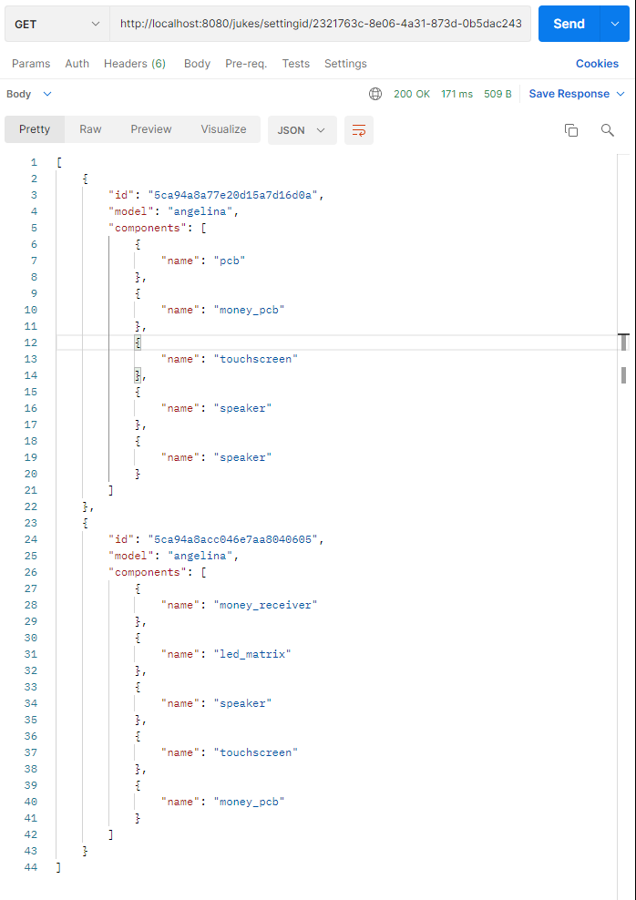
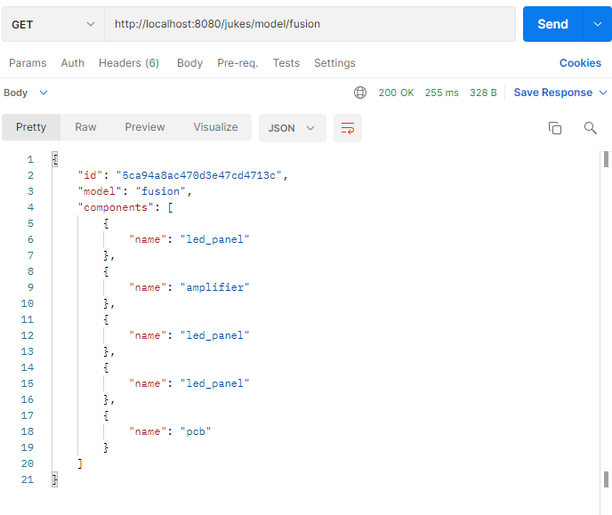
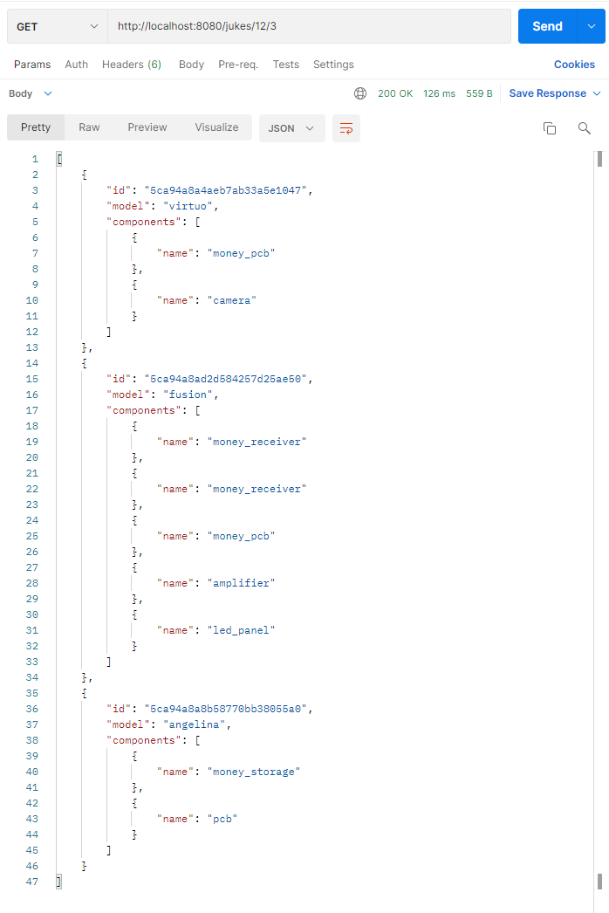
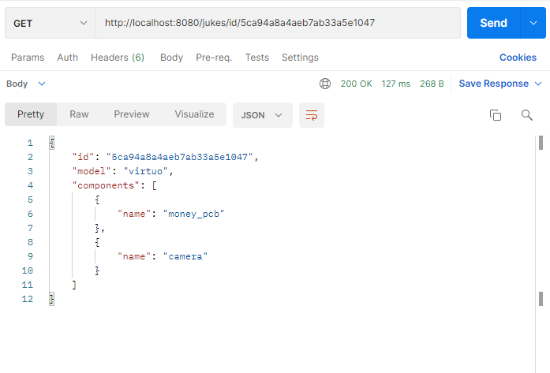

# A Rest Api

_Authur: Jiadi Yu_

_Date: 2022-04-15_

## Introduction
A REST API with a single GET endpoint which returns a paginated list of jukeboxes that suppport a given setting id. It should support following query parameters:

 - `settingId` - setting id (required)
 - `model` - filter by model name (optional)
 - `offset` - specifies at what index start the page (optional)
 - `limit` - specifies the page size (optional)

And of course we have the unit tests !
 ## Tools and references
 ### Framework
 **Spring**

## Tool
* **jsonschema2pojo**

 ## References
1. [Official Apache Maven documentation](https://maven.apache.org/guides/index.html)
2. [What is a REST API (Chinese version)](https://www.redhat.com/zh/topics/api/what-is-a-rest-api)
3. [How to Call or Consume External API in Spring Boot?](https://www.geeksforgeeks.org/how-to-call-or-consume-external-api-in-spring-boot/)
4. [REST API concepts and examples](https://www.youtube.com/watch?v=7YcW25PHnAA&t=467s)
5. [Calling an external API - Spring Boot Microservices Level 2 by JavaBrains](https://www.youtube.com/watch?v=7nKKD2rKpUk)
6. [Spring Boot Tutorial | Full Course [2021] [NEW] by Amigoscode](https://www.youtube.com/watch?v=9SGDpanrc8U&t=1865s)

## Instructions
### Mocked URL : http://localhost:8080/
#### Salutation: http://localhost:8080/hello
### Functions(all about GET):
#### **How to use**
Run the java program, then using the given url below in browsers or *Postman* and send **GET** requests !

**Getting a juke or couple of jukes by**
1. settingId: http://localhost:8080/jukes/settingid/{settingId}
* 
2. model: http://localhost:8080/jukes/model/{model} 
* 
3. offset and limit: http://localhost:8080/jukes/{offset}/{limit}
* 
4. jukeId: http://localhost:8080/jukes/id/{id}
* 

